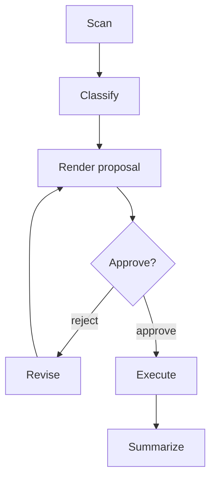

# nodecraft

Scan a directory, classify each node's purpose
and recommended action, propose a revised tree with an inline-annotated
diagram, gate on human approval, then execute and log the changes.

## Quick start

This project uses [uv](https://docs.astral.sh/uv/) for environments and
dependencies, [Ruff](https://docs.astral.sh/ruff/) for linting and formatting,
and [ty](https://docs.astral.sh/ty/) for type checking.

```sh
uv sync

# Run checks
uv run pytest
uv run ruff check .
uv run ruff format --check .
uv run ty check

# Suppress progress output (useful for CI/scripts)
uv run python cli.py run /path/to/directory --auto-approve --quiet
uv run python cli.py scan /path/to/directory --quiet
uv run python cli.py classify-chunks runs/<run_id>/chunks/manifest.json

# Large trees: skip hashing files above 100 MB and reuse the persistent cache
uv run python cli.py scan /path/to/directory --hash-mode conditional --max-hash-size 100MB
uv run python cli.py scan /path/to/directory --hash-mode none --no-cache

# Full pipeline, interactive approval prompt:
uv run python cli.py run /path/to/directory

# Full pipeline, skip the prompt (approves iteration 1 automatically —
# use only for trusted/CI runs):
uv run python cli.py run /path/to/directory --auto-approve
# Run the same pipeline as a contained canonical subtree
uv run python cli.py run /path/to/directory --subtree src --auto-approve

# Individual stages (mirrors the T1-T7 pipeline):
uv run python cli.py scan /path/to/directory --dry-run
uv run python cli.py classify runs/<run_id>/chunks/chunk-000001-*.json --dry-run
uv run python cli.py render <chunk.json> <classification.json> --dry-run
# Scan directly into independently classifiable chunks
uv run python cli.py scan /path/to/directory \
  --max-nodes 10000 --max-bytes 8MB
```

Use `uv sync --extra llm` to install the optional Anthropic dependency needed
by `--backend llm`.

Hashing is full and exact by default. For large trees, `--hash-mode conditional`
hashes only files at or below `--max-hash-size` (supports bytes or `KB`, `MB`,
and `GB` suffixes), while `--hash-mode none` skips content reads entirely.
Scans reuse hashes from `.nodecraft/hash-cache.json`; use `--no-cache` or
`--cache-path PATH` to control that behavior. Files without hashes cannot be
confirmed as content duplicates. Execution paths must remain relative to the
selected root; absolute paths, parent traversal, and symlink escapes are
rejected. The scanner uses a portable creation-time fallback on platforms that
do not expose `st_birthtime`.

Snapshots and downstream artifacts carry optional `scope` and `provenance`
metadata. `summarize-subtree` accepts a normalized POSIX relative path,
includes exactly that node and its descendants as a canonical tree rooted at
`.`, composes scopes when its input is already scoped, and never changes the
source artifacts. Derived output names include a scope hash and refuse source,
duplicate, or existing output paths. Use `--dry-run` to inspect the report
without writing the derived snapshot, classification, or report. A missing
subtree path is an error.

`scan` writes a bounded-memory depth-first stream of schema-valid tree chunks
to `runs/<run_id>/chunks/manifest.json` and the adjacent chunk files. Each
chunk carries node/byte budgets, provenance, first/last paths, and an
oversized marker for a single node that cannot fit the configured budget. The
manifest is written last and references content hashes for every chunk, so
chunks can be classified independently as soon as they appear.

`classify-chunks` consumes that manifest one chunk at a time, writes schema-valid
classification artifacts under `chunks/classifications/`, and atomically updates
the manifest with per-chunk and aggregate classification status. The full
orchestrator uses this same path; it never reassembles a giant snapshot.

On Windows, scanner availability is checked with `GetFileAttributesW` only
(file content is never opened for this check). Cloud-only placeholders are
marked with `availability: "cloud_only"` and are never hashed. Pass
`--skip-cloud-only` to omit them from the snapshot; progress output includes
the skipped count and bytes. The option is a no-op on non-Windows platforms.

## Layout

```
schemas/             JSON Schemas for every inter-task artifact (I1)
lib/
  validate.py         schema validation utility (I2)
  trace.py            run_id / timestamps / hashing utility (I3)
scripts/
  scan.py             Streaming chunk scanner — T1, deterministic (I4)
  render_proposal.py  Proposal Renderer — T3, deterministic (I6)
  approve.py          Approval capture — T4, human gate (I7)
  execute.py          Executor — T6, deterministic, only script that mutates disk (I9)
  summarize.py        Summary generator — T7, deterministic (I10)
agent/
  classify.py         Classifier — T2, agent-assisted, pluggable backend (I5)
  revise.py           Revise step — T5, reuses classify.py (I8)
orchestrator.py        sequences T1-T7, enforces schema + approval gates (I16)
cli.py                 single entrypoint dispatching to the above (I17)
tests/
  fixtures/            sample tree + golden outputs (I11)
  test_scan.py         (I12)
  test_render_proposal.py (I13)
  test_execute.py      (I14)
  test_e2e.py           full pipeline incl. reject->revise->approve (I18)
```

## Pipeline DAG



Every stage produces a schema-validated artifact. Rejected proposals create a
new iteration rather than overwriting prior artifacts; T6 is unreachable until
an approval decision explicitly approves the current proposal. See
[docs/pipeline-dag.md](C:/Users/matth/workplace/nodecraft/docs/pipeline-dag.md)
for the detailed repository mapping.

## Design notes carried over from the spec

- **Determinism by default.** Only `agent/classify.py` (and `revise.py`,
  which reuses it) calls an LLM. Everything else — scan, diff/render,
  execute, summarize — is a pure function you can unit test without any
  network access. `HeuristicBackend` (rule-based) is the default classifier
  backend precisely so the whole pipeline is runnable and testable offline;
  `LLMBackend` implements the same interface and is a `--backend llm` flag
  away.
- **Schema-validated I/O.** Every artifact is validated against
  `schemas/*.schema.json` before being written (`lib/validate.py`) — a
  script refuses to produce invalid output rather than passing it downstream.
- **Reversibility.** `execute.py` archives deletes into `.trash/<run_id>/`
  by default (pass `--permanent-delete` to skip that) and always emits an
  `undo.py` script that can reverse moves/renames/archives on Windows, macOS,
  and Linux.
- **Append-only revision history.** The T4→T5→T3 rejection loop is modeled
  as new `iteration` numbers, not overwrites — `proposal.v1.json`,
  `proposal.v2.json`, etc. all persist under `runs/<run_id>/`.

## Why the build order mattered (Section C)

`I1` (the five schemas) was the only real blocker. Once it landed, the
Scanner, Classifier, Proposal Renderer, Executor, and Summary generator
were each built and unit-tested (I12–I14) against **fixture JSON**, not
against each other's live output — e.g. `test_render_proposal.py` never
imports or runs `scan.py` or `classify.py`. That's the practical payoff of
schema-first design: those components could have been built by five
different people in parallel with no coordination beyond agreeing on the
schemas. The Orchestrator (I16) was necessarily the first task that needed
every component's *real* interface, not just its schema, since it imports
and calls them directly — which is why it's scheduled last among the
"build" tasks, right before the CLI wrapper and the end-to-end test.

## Known limitations / follow-ups

- `HeuristicBackend`'s rules are intentionally simple (extension/path
  pattern matching) — good enough to prove the pipeline end-to-end, but a
  real deployment should lean on `LLMBackend` for anything not obviously
  build-artifact/cache/backup-shaped.
- `approve.py`'s interactive mode is a plain `input()` prompt, not the
  "edit the diagram directly" capture mechanism discussed for a richer
  version of this tool — the diagram is rendered as an editable plain-text
  tree specifically so that upgrade path stays open without a schema change.
- No retry/backoff around `LLMBackend`'s API calls beyond the
  schema-validation retry already implemented.
