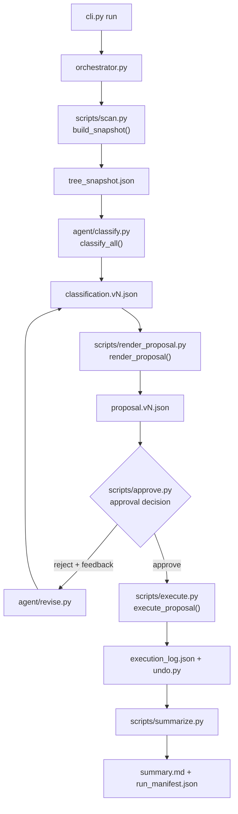

# Pipeline DAG

This document maps the runtime DAG to the commands, modules, and artifacts
that exist in the repository.

## Stage mapping

| Stage | Repository implementation | Primary artifact |
| --- | --- | --- |
| T1 | `scripts/scan.py` | `tree_snapshot.json` |
| T2 | `agent/classify.py` | `classification.vN.json` |
| T3 | `scripts/render_proposal.py` | `proposal.vN.json` |
| T4 | `scripts/approve.py` | `approval_decision.vN.json` |
| T5 | `agent/revise.py` | next `classification.vN.json` |
| T6 | `scripts/execute.py` | `execution_log.json`, `undo.py` |
| T7 | `scripts/summarize.py` | `summary.md`, `run_manifest.json` |

`orchestrator.py` sequences these stages and enforces schema validation and the
approval gate. A rejection starts a new classification/proposal iteration; it
does not overwrite earlier artifacts. Execution is only reachable after an
approval decision for the current proposal.
