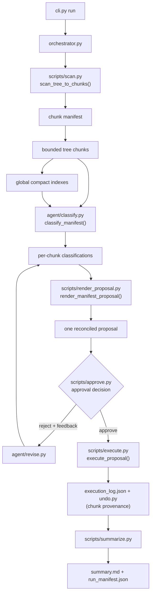
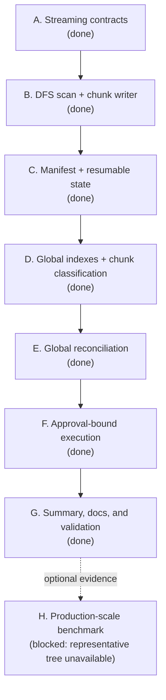

# Pipeline DAG

This document maps the current **streaming, chunk-first** runtime DAG to the
commands, modules, artifacts, and delivery tasks in the repository. The
project intentionally does not maintain a legacy full-snapshot compatibility
path.

## Runtime stage mapping

| Stage | Repository implementation | Primary artifact |
| --- | --- | --- |
| T1 | `scripts/scan.py` | `chunks/manifest.json` + bounded chunk snapshots |
| T2 | `agent/classify.py` | per-chunk `classification.vN.json` |
| T3 | `scripts/render_proposal.py` | one globally reconciled `proposal.vN.json` |
| T4 | `scripts/approve.py` | `approval_decision.vN.json` |
| T5 | `agent/revise.py` | next `classification.vN.json` |
| T6 | `scripts/execute.py` | `execution_log.json`, `undo.py` with chunk IDs |
| T7 | `scripts/summarize.py` | global summary + per-chunk status counts |

`orchestrator.py` sequences these stages and enforces schema validation and the
approval gate. A rejection starts a new classification/proposal iteration; it
does not overwrite earlier artifacts. Execution is only reachable after an
approval decision for the current proposal.

## Consolidated delivery DAG

### Task definitions

| ID | Deliverable | Depends on | Status |
| --- | --- | --- | --- |
| A | Define chunk, scope, provenance, and availability contracts | — | Done |
| B | Scan depth-first into bounded immutable chunks | A | Done |
| C | Persist manifest state and support restart/resume | B | Done |
| D | Build compact global indexes and classify chunks, including bounded parallelism | B, C | Done |
| E | Reconcile all chunk operations into one conflict-checked proposal | D | Done |
| F | Bind approval to proposal hash; execute safely with centralized undo and chunk provenance | E | Done |
| G | Aggregate summaries, document operation, and run repository validation | F | Done |
| H | Benchmark against a representative production-scale tree | G | Blocked by environment |

Compatibility/migration is deliberately **not** a dependency of delivery. A
full-snapshot compatibility mode would be a separate future project, not a
requirement for this single-project chunk-first pipeline.
